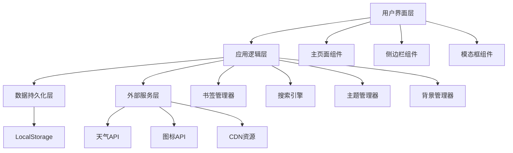

# 个人导航页面增强项目 - 设计文档

## 概述

本设计文档描述了如何将 `ai_studio_code (1).html` 的功能整合到 `index.html` 中，并添加 iTab 风格的实用功能，创建一个功能完善、美观易用的个人导航页面。

## 架构设计

### 整体架构



### 技术栈

- **前端框架**: Alpine.js 3.13.3（轻量级响应式框架）
- **CSS 框架**: Tailwind CSS（通过 CDN）
- **图标库**: Font Awesome 4.7.0
- **字体**: Inter（Google Fonts）
- **数据存储**: LocalStorage
- **部署平台**: Cloudflare Pages

## 组件设计

### 1. 主页面布局

```html
<body>
  ├── 背景层（自定义背景 + 遮罩）
  ├── 顶部导航栏
  │   ├── Logo
  │   ├── 主题切换按钮
  │   └── 设置按钮
  ├── 主内容区
  │   ├── 左侧边栏
  │   │   ├── 时钟组件
  │   │   ├── 天气组件
  │   │   ├── 搜索框
  │   │   ├── 待办事项
  │   │   ├── 访问统计
  │   │   └── 分类导航
  │   └── 右侧内容区
  │       ├── 励志语录
  │       ├── 分类标签栏
  │       └── 书签网格
  └── 模态框层
      ├── 设置面板
      ├── 添加书签对话框
      ├── 编辑书签对话框
      ├── 笔记编辑器
      └── 密码保护对话框
</body>
```

### 2. 数据模型

#### 书签数据结构

```javascript
{
  id: string,              // 唯一标识符 (UUID)
  title: string,           // 书签标题
  url: string,             // 网站URL
  icon: string,            // 图标URL或DataURI
  category: string,        // 所属分类
  tags: string[],          // 标签数组
  visitCount: number,      // 访问次数
  lastVisit: timestamp,    // 最后访问时间
  createdAt: timestamp,    // 创建时间
  order: number            // 排序序号
}
```

#### 分类数据结构

```javascript
{
  id: string,              // 分类ID
  name: string,            // 分类名称
  icon: string,            // 分类图标
  order: number,           // 排序序号
  protected: boolean       // 是否需要密码保护
}
```

#### 设置数据结构

```javascript
{
  theme: 'light' | 'dark' | 'auto',
  language: 'zh-CN' | 'en-US' | 'ja-JP',
  backgroundImage: string,
  backgroundOpacity: number,
  searchEngine: 'google' | 'bing' | 'baidu',
  clockFormat: '12h' | '24h',
  weatherLocation: string,
  showQuote: boolean,
  focusMode: boolean,
  customQuotes: string[]
}
```

#### 待办事项数据结构

```javascript
{
  id: string,
  content: string,
  completed: boolean,
  createdAt: timestamp,
  completedAt: timestamp
}
```

#### 笔记数据结构

```javascript
{
  id: string,
  title: string,
  content: string,
  createdAt: timestamp,
  updatedAt: timestamp
}
```

### 3. 核心功能模块

#### 3.1 书签管理器 (BookmarkManager)

**职责**:
- 添加、编辑、删除书签
- 书签排序和分类
- 书签搜索和筛选
- 访问统计记录

**关键方法**:
```javascript
class BookmarkManager {
  addBookmark(bookmark)
  updateBookmark(id, updates)
  deleteBookmark(id)
  getBookmarksByCategory(category)
  searchBookmarks(query)
  recordVisit(id)
  getTopVisited(limit)
  reorderBookmarks(categoryId, newOrder)
  exportBookmarks(format)
  importBookmarks(data)
}
```

#### 3.2 图标获取器 (IconFetcher)

**职责**:
- 自动获取网站图标
- 图标缓存管理
- 备用图标生成

**获取策略**:
1. 优先使用用户提供的自定义图标
2. 尝试 Google Favicon API: `https://www.google.com/s2/favicons?domain={domain}&sz=64`
3. 尝试网站根目录: `{url}/favicon.ico`
4. 使用 UI Avatars 生成字母图标: `https://ui-avatars.com/api/?name={title}&background=random&color=fff&size=64`

**关键方法**:
```javascript
class IconFetcher {
  async fetchIcon(url, title)
  getCachedIcon(url)
  cacheIcon(url, iconData)
  generateFallbackIcon(title)
}
```

#### 3.3 搜索引擎 (SearchEngine)

**职责**:
- 多引擎搜索支持
- 搜索历史管理
- 搜索建议

**支持的搜索引擎**:
```javascript
const SEARCH_ENGINES = {
  google: {
    name: 'Google',
    url: 'https://www.google.com/search?q=',
    icon: 'fa-google',
    suggestions: 'https://suggestqueries.google.com/complete/search?client=firefox&q='
  },
  bing: {
    name: 'Bing',
    url: 'https://www.bing.com/search?q=',
    icon: 'fa-windows',
    suggestions: 'https://api.bing.com/osjson.aspx?query='
  },
  baidu: {
    name: 'Baidu',
    url: 'https://www.baidu.com/s?wd=',
    icon: 'fa-paw',
    suggestions: 'https://suggestion.baidu.com/su?wd='
  }
}
```

#### 3.4 主题管理器 (ThemeManager)

**职责**:
- 明暗主题切换
- 自动跟随系统主题
- 主题配色管理

**主题配色方案**:
```javascript
const THEMES = {
  light: {
    primary: '#4F46E5',
    secondary: '#818CF8',
    background: '#F8FAFC',
    text: '#1E293B',
    card: 'rgba(255, 255, 255, 0.95)'
  },
  dark: {
    primary: '#818CF8',
    secondary: '#C7D2FE',
    background: '#0f172a',
    text: '#F8FAFC',
    card: 'rgba(30, 41, 59, 0.95)'
  }
}
```

#### 3.5 背景管理器 (BackgroundManager)

**职责**:
- 自定义背景图片
- 背景遮罩调节
- 图片上传和压缩

**关键方法**:
```javascript
class BackgroundManager {
  setBackgroundImage(url)
  uploadBackgroundImage(file)
  setBackgroundOpacity(opacity)
  resetToDefault()
  compressImage(file, maxSize)
}
```

#### 3.6 天气服务 (WeatherService)

**职责**:
- 获取当前天气
- 位置检测
- 天气数据缓存

**API 选择**:
- 主要: OpenWeatherMap API (免费额度充足)
- 备用: 和风天气 API (国内访问更快)

**关键方法**:
```javascript
class WeatherService {
  async getCurrentWeather(location)
  async detectLocation()
  getCachedWeather()
  cacheWeather(data, ttl)
}
```

#### 3.7 励志语录管理器 (QuoteManager)

**职责**:
- 随机显示励志语录
- 多语言语录支持
- 自定义语录管理

**语录数据结构**:
```javascript
const QUOTES = {
  'zh-CN': [
    { text: '每一个不曾起舞的日子，都是对生命的辜负。', author: '尼采' },
    { text: '生活不是等待暴风雨过去，而是学会在雨中跳舞。', author: '佚名' }
  ],
  'en-US': [
    { text: 'The only way to do great work is to love what you do.', author: 'Steve Jobs' },
    { text: 'Believe you can and you\'re halfway there.', author: 'Theodore Roosevelt' }
  ]
}
```

#### 3.8 待办事项管理器 (TodoManager)

**职责**:
- 添加、编辑、删除待办
- 完成状态切换
- 待办排序

**关键方法**:
```javascript
class TodoManager {
  addTodo(content)
  toggleTodo(id)
  deleteTodo(id)
  getTodos(filter)
  clearCompleted()
}
```

#### 3.9 笔记管理器 (NoteManager)

**职责**:
- 创建和编辑笔记
- Markdown 渲染
- 笔记搜索

**关键方法**:
```javascript
class NoteManager {
  createNote(title, content)
  updateNote(id, updates)
  deleteNote(id)
  searchNotes(query)
  renderMarkdown(content)
}
```

## 界面设计

### 配色方案

#### 主色调
- **Primary**: #4F46E5 (Indigo 600)
- **Secondary**: #818CF8 (Indigo 400)
- **Accent**: #C7D2FE (Indigo 200)

#### 中性色
- **Dark**: #1E293B (Slate 800)
- **Light**: #F8FAFC (Slate 50)
- **Gray**: #64748B (Slate 500)

#### 功能色
- **Success**: #10B981 (Green 500)
- **Warning**: #F59E0B (Amber 500)
- **Error**: #EF4444 (Red 500)
- **Info**: #3B82F6 (Blue 500)

### 字体优化

#### 字体大小层级
```css
--text-xs: 0.75rem;    /* 12px - 次要信息 */
--text-sm: 0.875rem;   /* 14px - 辅助文字 */
--text-base: 1rem;     /* 16px - 正文 */
--text-lg: 1.125rem;   /* 18px - 小标题 */
--text-xl: 1.25rem;    /* 20px - 标题 */
--text-2xl: 1.5rem;    /* 24px - 大标题 */
--text-3xl: 1.875rem;  /* 30px - 特大标题 */
--text-4xl: 2.25rem;   /* 36px - 时钟等 */
```

#### 字体颜色优化
```css
/* 明亮主题 */
--text-primary: rgba(30, 41, 59, 1);      /* 主要文字 */
--text-secondary: rgba(100, 116, 139, 1); /* 次要文字 */
--text-tertiary: rgba(148, 163, 184, 1);  /* 辅助文字 */

/* 暗色主题 */
--text-primary-dark: rgba(248, 250, 252, 0.95);   /* 主要文字 */
--text-secondary-dark: rgba(226, 232, 240, 0.8);  /* 次要文字 */
--text-tertiary-dark: rgba(203, 213, 225, 0.6);   /* 辅助文字 */

/* 文字阴影（提高可读性） */
text-shadow: 0 1px 2px rgba(0, 0, 0, 0.1);
```

### 毛玻璃效果

```css
.glass-panel {
  background: rgba(255, 255, 255, 0.15);
  backdrop-filter: blur(20px);
  -webkit-backdrop-filter: blur(20px);
  border: 1px solid rgba(255, 255, 255, 0.2);
  box-shadow: 0 8px 32px 0 rgba(0, 0, 0, 0.1);
}

.glass-card {
  background: rgba(255, 255, 255, 0.1);
  backdrop-filter: blur(10px);
  -webkit-backdrop-filter: blur(10px);
  border: 1px solid rgba(255, 255, 255, 0.15);
  transition: all 0.3s cubic-bezier(0.4, 0, 0.2, 1);
}

.glass-card:hover {
  background: rgba(255, 255, 255, 0.2);
  transform: translateY(-4px);
  box-shadow: 0 12px 40px rgba(0, 0, 0, 0.15);
}
```

### 动画效果

#### 页面加载动画
```css
@keyframes fadeInUp {
  from {
    opacity: 0;
    transform: translateY(20px);
  }
  to {
    opacity: 1;
    transform: translateY(0);
  }
}

.animate-fade-in {
  animation: fadeInUp 0.5s ease-out forwards;
}
```

#### 卡片悬停动画
```css
.bookmark-card {
  transition: all 0.3s cubic-bezier(0.4, 0, 0.2, 1);
}

.bookmark-card:hover {
  transform: translateY(-6px) scale(1.02);
  box-shadow: 0 20px 40px rgba(79, 70, 229, 0.2);
}
```

#### 加载骨架屏
```css
@keyframes shimmer {
  0% {
    background-position: -1000px 0;
  }
  100% {
    background-position: 1000px 0;
  }
}

.skeleton {
  background: linear-gradient(
    90deg,
    rgba(255, 255, 255, 0.1) 25%,
    rgba(255, 255, 255, 0.2) 50%,
    rgba(255, 255, 255, 0.1) 75%
  );
  background-size: 1000px 100%;
  animation: shimmer 2s infinite;
}
```

## 响应式设计

### 断点定义
```css
/* 移动设备 */
@media (max-width: 640px) { /* sm */ }

/* 平板设备 */
@media (min-width: 641px) and (max-width: 1024px) { /* md */ }

/* 桌面设备 */
@media (min-width: 1025px) { /* lg */ }

/* 大屏设备 */
@media (min-width: 1280px) { /* xl */ }
```

### 布局适配

#### 移动端 (< 640px)
- 单列布局
- 侧边栏改为抽屉式
- 书签卡片 2 列网格
- 隐藏部分次要信息

#### 平板端 (641px - 1024px)
- 侧边栏固定显示
- 书签卡片 3-4 列网格
- 显示主要功能

#### 桌面端 (> 1024px)
- 完整布局
- 书签卡片 4-6 列网格
- 显示所有功能

## 性能优化策略

### 1. 懒加载
- 书签图标使用 `loading="lazy"` 属性
- 超过 50 个书签时启用虚拟滚动
- 图片使用 Intersection Observer 延迟加载

### 2. 数据压缩
```javascript
// 使用 LZ-String 压缩 LocalStorage 数据
const compressedData = LZString.compress(JSON.stringify(data));
localStorage.setItem('bookmarks', compressedData);
```

### 3. 防抖和节流
```javascript
// 搜索输入防抖
const debouncedSearch = debounce((query) => {
  searchBookmarks(query);
}, 300);

// 滚动事件节流
const throttledScroll = throttle(() => {
  updateScrollPosition();
}, 100);
```

### 4. 缓存策略
- 天气数据缓存 30 分钟
- 图标缓存 7 天
- 搜索建议缓存 1 小时

### 5. CDN 优化
```html
<!-- 使用 CDN 加载外部资源 -->
<script src="https://cdn.tailwindcss.com"></script>
<script defer src="https://cdn.jsdelivr.net/npm/alpinejs@3.13.3/dist/cdn.min.js"></script>
<link href="https://cdn.jsdelivr.net/npm/font-awesome@4.7.0/css/font-awesome.min.css" rel="stylesheet">
```

## 错误处理

### 1. 网络错误
```javascript
async function fetchWithRetry(url, options, retries = 3) {
  try {
    const response = await fetch(url, options);
    if (!response.ok) throw new Error('Network response was not ok');
    return response;
  } catch (error) {
    if (retries > 0) {
      await new Promise(resolve => setTimeout(resolve, 1000));
      return fetchWithRetry(url, options, retries - 1);
    }
    throw error;
  }
}
```

### 2. 数据验证
```javascript
function validateBookmark(bookmark) {
  const errors = [];
  
  if (!bookmark.title || bookmark.title.trim() === '') {
    errors.push('标题不能为空');
  }
  
  if (!bookmark.url || !isValidURL(bookmark.url)) {
    errors.push('URL 格式无效');
  }
  
  return errors.length === 0 ? null : errors;
}
```

### 3. 用户友好的错误提示
```javascript
function showError(message, type = 'error') {
  const toast = document.createElement('div');
  toast.className = `toast toast-${type}`;
  toast.textContent = message;
  document.body.appendChild(toast);
  
  setTimeout(() => {
    toast.classList.add('fade-out');
    setTimeout(() => toast.remove(), 300);
  }, 3000);
}
```

## 安全性考虑

### 1. XSS 防护
```javascript
function sanitizeHTML(html) {
  const div = document.createElement('div');
  div.textContent = html;
  return div.innerHTML;
}
```

### 2. URL 验证
```javascript
function isValidURL(url) {
  try {
    const parsed = new URL(url);
    return ['http:', 'https:'].includes(parsed.protocol);
  } catch {
    return false;
  }
}
```

### 3. 密码保护
```javascript
// 使用简单的哈希验证（客户端）
function verifyPassword(input) {
  const hashedPassword = 'e10adc3949ba59abbe56e057f20f883e'; // MD5('123456')
  return md5(input) === hashedPassword;
}
```

## 测试策略

### 1. 单元测试
- 书签管理器功能测试
- 数据验证测试
- 工具函数测试

### 2. 集成测试
- LocalStorage 读写测试
- API 调用测试
- 组件交互测试

### 3. 端到端测试
- 用户流程测试
- 跨浏览器兼容性测试
- 响应式布局测试

### 4. 性能测试
- 页面加载时间 < 2 秒
- 首次内容绘制 < 1 秒
- 交互响应时间 < 100ms

## 部署配置

### Cloudflare Pages 配置

#### 构建设置
```yaml
# 不需要构建步骤，直接部署静态文件
Build command: (留空)
Build output directory: /
Root directory: /
```

#### 环境变量
```
WEATHER_API_KEY=your_openweathermap_api_key
```

#### 自定义域名
```
1. 在 Cloudflare Pages 中添加自定义域名
2. 配置 DNS 记录指向 Cloudflare Pages
3. 启用 HTTPS（自动）
```

#### Headers 配置
```toml
# _headers 文件
/*
  X-Frame-Options: DENY
  X-Content-Type-Options: nosniff
  X-XSS-Protection: 1; mode=block
  Referrer-Policy: strict-origin-when-cross-origin
  Permissions-Policy: geolocation=(self), microphone=(), camera=()
```

## 浏览器兼容性

### 支持的浏览器
- Chrome/Edge 90+
- Firefox 88+
- Safari 14+
- Opera 76+

### Polyfills
```html
<!-- 为旧浏览器提供支持 -->
<script src="https://cdn.jsdelivr.net/npm/@webcomponents/webcomponentsjs@2/webcomponents-loader.js"></script>
<script src="https://cdn.jsdelivr.net/npm/intersection-observer@0.12.0/intersection-observer.js"></script>
```

## 未来扩展

### 可能的功能扩展
1. **云同步**: 使用 Cloudflare KV 实现跨设备同步
2. **浏览器扩展**: 开发 Chrome/Firefox 扩展版本
3. **PWA 支持**: 添加 Service Worker 实现离线访问
4. **AI 推荐**: 基于访问历史智能推荐网站
5. **团队协作**: 支持多用户共享书签
6. **RSS 阅读器**: 集成 RSS 订阅功能
7. **番茄钟**: 添加时间管理工具
8. **习惯追踪**: 记录和追踪日常习惯

## 总结

本设计文档提供了一个完整的技术方案，将 `ai_studio_code (1).html` 的功能与 `index.html` 的美观设计相结合，并添加了 iTab 风格的实用功能。通过模块化的架构设计、优化的性能策略和完善的错误处理，确保最终产品既美观又实用，能够满足用户的各种需求。
